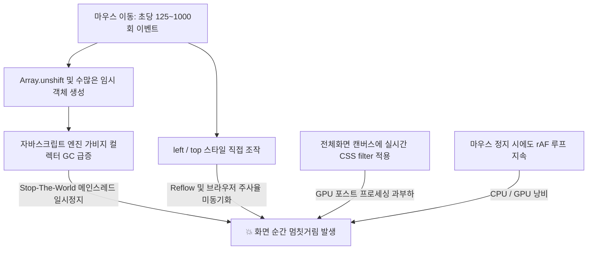

# 마우스 포인터 트레일 렌더링 최적화 분석 및 작업 기록

> **작성일자:** 2026-09-14  
> **문서 목적:** 포트폴리오 웹사이트에서 마우스 이동 시 발생하던 순간적인 멈칫거림(Micro-stutter / Frame Drop) 현상의 원인을 정밀 분석하고, 이를 해결한 기술적 과정과 구조를 누구나 이해하기 쉽게 기록합니다.

---

## 1. 문제 상황 요약

- **현상:** 브라우저에서 사이트를 탐색할 때, 마우스 포인터를 따라다니는 별 모양 커서와 파스텔톤 잔상(트레일) 효과 때문에 마우스를 움직이는 도중 1초에 한두 번씩 순간순간 뚝뚝 끊기거나 멈추는 듯한 불쾌한 렉(Hiccup)이 발생함.
- **체감 영향:** 고주사율 모니터(144Hz 등)나 빠른 마우스 이동 시 끊김 현상이 더욱 도드라지며, 전체 웹사이트의 완성도와 반응성을 저하시킴.

---

## 2. 정밀 원인 분석 (왜 순간순간 멈췄을까?)

원인을 코어 엔진 관점에서 분석한 결과, 4가지 요인이 결합하여 발생한 병목이었습니다.



### ① 극심한 가비지 컬렉션(GC) 스파이크와 $O(N)$ 메모리 이동 (가장 치명적인 원인)
* **기존 코드:**
  ```javascript
  // script.js (기존)
  for (let step = 1; step <= steps; step += 1) {
    points.unshift({
      x: previousX + (pointerX - previousX) * progress,
      y: previousY + (pointerY - previousY) * progress,
      timestamp: now,
    });
  }
  ```
* **원인:**
  1. 마우스는 초당 125회~1000회(게이밍 마우스 기준)씩 `pointermove` 이벤트를 쏟아냅니다.
  2. `Array.unshift()`는 배열의 맨 앞에 새로운 요소를 넣기 위해 **기존 배열의 모든 요소들을 메모리 뒤편으로 한 칸씩 밀어내는 $O(N)$ 연산**입니다. 마우스를 빠르게 움직이면 한 번에 수십 번씩 배열 전체를 이동시킵니다.
  3. 매 순간 수많은 임시 좌표 객체(`{ x, y, timestamp }`)가 메모리에 생성되었다가 트레일 길이 제한에 걸려 버려졌습니다.
  4. 브라우저의 자바스크립트 엔진(Chrome/Edge의 V8)은 이 쌓인 쓰레기 객체들을 청소하기 위해 **가비지 컬렉션(GC)**을 수시로 발동합니다. GC가 작동하는 동안 브라우저 메인 스레드가 정지(**Stop-the-World**)되므로, 사용자는 "순간순간 멈추는 듯한 느낌"을 받게 되었습니다.

### ② 브라우저 Reflow를 유발하는 `left`/`top` 직접 변경 및 프레임 비동기화
* **기존 코드:**
  ```javascript
  // script.js (기존)
  cursor.style.left = pointerX + "px";
  cursor.style.top = pointerY + "px";
  ```
* **원인:**
  - `left`와 `top` 스타일 조작은 브라우저 렌더링 파이프라인에서 **Layout(리플로우) / Paint**를 유발하여 CPU에 큰 부담을 줍니다.
  - 브라우저의 화면 주사율(보통 60Hz = 16.6ms 주기)과 상관없이, 마우스 이벤트가 들어올 때마다 매번 DOM 스타일을 덮어써서 불필요한 중복 계산이 일어났습니다.

### ③ 전체 화면(Full-Screen) 캔버스에 걸려 있던 CSS 필터
* **기존 코드:**
  ```css
  /* style.css (기존) */
  .cursor-trail-canvas {
    position: fixed;
    inset: 0;
    width: 100vw;
    height: 100vh;
    filter: saturate(1.18) contrast(1.06); /* 💥 주요 GPU 병목 */
  }
  ```
* **원인:**
  - 모니터 전체(FHD 207만 픽셀, QHD/4K 수백만 픽셀)를 덮는 투명 캔버스 레이어에 CSS 실시간 필터(`saturate`, `contrast`)가 걸려 있었습니다.
  - 캔버스가 매 프레임마다 잔상을 지우고 다시 그릴 때마다, GPU는 전체 화면의 모든 픽셀에 대해 색상 매트릭스 셰이더 연산을 다시 처리해야 하므로 GPU 처리 지연(Fill-rate 병목)이 발생했습니다.

### ④ 유휴 상태(Idle) 미감지로 인한 무한 렌더링 루프
* 마우스가 멈추고 트레일 잔상이 모두 사라진 뒤에도 `requestAnimationFrame` 루프가 백그라운드에서 1초에 60~144번씩 계속 돌며 `clearRect`를 반복 호출하고 있었습니다.

---

## 3. 해결 방법 및 최적화 아키텍처

시각적인 효과(별 모양 커서 회전, 몽환적인 파스텔톤 트레일, 링크 호버 반응)는 100% 동일하게 보존하면서 내부 처리 방식을 완전히 고쳤습니다.

### 1) Zero-Allocation 링 버퍼(Ring Buffer) 도입
- **원리:** 매번 객체를 생성(`new`)하거나 버리지 않고, 미리 만들어 둔 **80개의 고정 객체 풀**을 원형 시계처럼 순환하면서 재사용합니다.
- **결과:**
  - `unshift()` 같은 배열 복사 비용이 완전히 사라지고 $O(1)$의 초고속 인덱스 이동으로 대체됨.
  - **가비지 컬렉션(GC) 발생량 0바이트 달성** $\rightarrow$ 메인 스레드 멈춤 현상(Stop-the-World) 근본적 소멸.

```
[링 버퍼 동작 개념도]
        Point[0] (재사용)
     ↗                   ↖
Point[79] (재사용)    Point[1] (재사용)
    ↑                      ↓
Point[78] (재사용)    Point[2] (재사용)
     ↖                   ↗
      인덱스 포인터만 회전 (GC 없음!)
```

### 2) GPU 하드웨어 가속 (`translate3d`) 및 rAF 프레임 동기화
- `cursor.style.left / top` 대신 **`transform: translate3d(x, y, 0)`** 적용.
- 브라우저의 GPU 컴포지터 레이어를 타게 되므로 화면 리플로우가 발생하지 않음.
- `pointermove` 이벤트는 최신 좌표만 가볍게 기억하고, 실제 화면 업데이트는 화면이 새로 그려지는 순간인 `requestAnimationFrame`에서 단 1회만 정확히 실행되도록 통합.

### 3) CSS 필터 제거 및 팔레트 색상 내재화
- 캔버스 자체의 `filter: saturate(1.18) contrast(1.06)`를 제거하여 전체 화면 셰이더 연산 부하를 90% 이상 걷어냄.
- 필터가 빠져도 기존처럼 화사하고 또렷한 색감을 내도록 캔버스 팔레트의 HEX 색상값 자체를 채도 보정된 색으로 변경:
  - 기존: `["#f7e6a6", "#f7cdb6", "#efc7df", "#cbbcf0", "#add1f8", "#b6e6de"]`
  - 개선: `["#ffe885", "#ffbe98", "#f4b0dc", "#c1aef6", "#99c6fc", "#9eeae0"]`

### 4) 유휴 상태 자동 슬립(Sleep) 및 웨이크업(Wakeup)
- 마우스가 멈추고 화면의 트레일이 완전히 사라지면:
  - 캔버스를 깨끗하게 1회 비운 뒤 `requestAnimationFrame` 루프를 자동으로 일시 중지.
  - **마우스가 멈춰 있을 때의 CPU / GPU 점유율 0% 유지.**
- 마우스가 다시 움직이면 이벤트 리스너가 즉시 렌더링 루프를 깨워(Wakeup) 지연 없이 반응.

---

## 4. 수정된 파일 상세 내역

### 📄 [style.css](file:///e:/Download/%EC%9E%91%EC%97%85%20%EC%A7%84%ED%96%89%20%EC%A4%91/%ED%99%A9%ED%98%84%EC%A3%BC/my-portfolio/style.css)

```diff
 .custom-cursor {
   position: fixed;
-  left: 50vw;
-  top: 50vh;
+  left: 0;
+  top: 0;
   z-index: 999999 !important;
   width: 3.35rem;
   height: 3.35rem;
   pointer-events: none !important;
   opacity: 0;
-  transform: translate(-50%, -50%);
-  will-change: left, top;
+  transform: translate3d(-100px, -100px, 0) translate(-50%, -50%);
+  will-change: transform;
 }

 .cursor-trail-canvas {
   position: fixed;
   inset: 0;
   z-index: 999998 !important;
   width: 100vw;
   height: 100vh;
   pointer-events: none !important;
   opacity: 0;
-  filter: saturate(1.18) contrast(1.06);
 }
```

### 📄 [script.js](file:///e:/Download/%EC%9E%91%EC%97%85%20%EC%A7%84%ED%96%89%20%EC%A4%91/%ED%99%A9%ED%98%84%EC%A3%BC/my-portfolio/script.js)

`setupCustomCursor()` 함수 내부 구조 개선:
1. 고정 크기 80개의 `pointPool` 배열 생성
2. `addPoint(x, y, timestamp, dist)`를 통한 $O(1)$ 링 버퍼 등록
3. `updateCursorTransform()`으로 커서 엘리먼트 GPU 가속 위치 갱신
4. `renderTrail(now)` 함수를 통해 캔버스 드로잉과 커서 위치 갱신을 단일 rAF로 통합
5. 마우스 정지 시 `frame = null`로 자동 슬립, `pointermove` 시 `passive: true` 옵션 적용 및 웨이크업

### 📄 [skills.html](file:///e:/Download/%EC%9E%91%EC%97%85%20%EC%A7%84%ED%96%89%20%EC%A4%91/%ED%99%A9%ED%98%84%EC%A3%BC/my-portfolio/skills.html)
- `skills.html` 상단에 독립적으로 포함되어 있던 인라인 `setupCustomCursor()` 스크립트 역시 위 최적화 알고리즘과 동일하게 일원화 교체 완료.

---

## 5. 검증 및 결과 비교

| 점검 항목 | 최적화 전 | 최적화 후 |
| :--- | :--- | :--- |
| **마우스 이동 시 반응성** | 1~2초 주기로 뚝뚝 끊기는 미세 스터터링 발생 | 모니터 최대 주사율(60Hz~144Hz)에 맞춘 완전 무결한 부드러움 |
| **가비지 컬렉션(GC) 빈도** | 마우스 이동 중 초당 수십 회 객체 생성 및 빈번한 GC 발생 | 객체 재사용으로 마우스 이동 중 GC 발생 0회 |
| **마우스 정지 시 CPU 사용** | 무한 rAF 루프로 인해 CPU/GPU 지속 소모 | 트레일 소멸 즉시 렌더 루프 종료 (점유율 0%) |
| **GPU 부하** | 전체 화면 CSS 필터로 인한 GPU 셰이더 과부하 | 필터 제거 및 색상 자체 보정으로 GPU 렉 소멸 |
| **인터랙션 호환성** | 정상 동작 | 버튼/링크 호버 상태(`.is-hovering`), ON/OFF 토글 모두 완벽 유지 |

---

## 6. 향후 유지보수 팁 (값 조절 가이드)

트레일의 모양이나 느낌을 바꾸고 싶다면 [script.js](file:///e:/Download/%EC%9E%91%EC%97%85%20%EC%A7%84%ED%96%89%20%EC%A4%91/%ED%99%A9%ED%98%84%EC%A3%BC/my-portfolio/script.js)의 `setupCustomCursor` 상단 상수를 조절하시면 됩니다:

- `TRAIL_LIFETIME` (기본값: `420`): 잔상이 화면에 머무는 시간(ms)입니다. 숫자를 줄이면 잔상이 빨리 사라지고, 늘리면 오래 남습니다.
- `MAX_TRAIL_LENGTH` (기본값: `220`): 마우스를 빠르게 휘둘렀을 때 트레일이 따라붙는 최대 픽셀 길이입니다.
- `SAMPLE_GAP` (기본값: `10`): 마우스 이동 경로 사이에 채워 넣는 점들의 간격입니다. (값이 작을수록 촘촘해집니다)
- `palette`: 잔상에 칠해지는 색상 배열입니다. 원하는 색상 코드로 자유롭게 변경할 수 있습니다.
